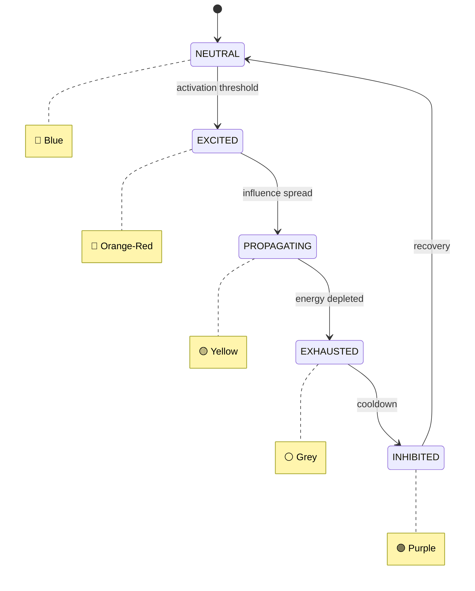

# Neuro-Social Simulation Engine

A standalone microservice that bridges in-silico neuroscience with social swarm simulation. It predicts how multi-modal media (e.g., travel videos) biologically resonates with individuals, and how that biological response drives viral social network dynamics.

## The Big Picture

Imagine you could peek inside someone's brain while they watch a travel video and see which regions light up — reward, emotion, motivation, social instinct. Now imagine you could take that brain response and use it to predict whether the video will spread like wildfire across a social network, or quietly fade away.

That's what this engine does, in three steps:

**1. Read the brain response.** We feed a piece of media (a video, an image, a song) into a neuroscience model that predicts how six key brain regions would react. Think of it as a "biological fingerprint" of the content — how rewarding it feels, how emotionally charged it is, how socially compelling it is.

**2. Simulate a crowd.** We spawn a swarm of 1,000 virtual people, each one a simple AI agent. The brain fingerprint from step 1 becomes the "DNA" of the crowd — it controls how excitable they are, how quickly they influence their neighbours, and when they burn out. High reward + low self-regulation = explosive cascade. High regulation = the crowd stays calm.

**3. Watch it unfold.** The simulation runs in real time and streams to a 3D visualization in your browser. You see agents light up, spread their excitement to neighbours, cluster into groups, and eventually exhaust themselves — a living, breathing model of how content propagates through a social network.

The result: before a single real person sees the content, you have a visual prediction of its viral potential — grounded in neuroscience, not guesswork.

## How It Works (Technical)

1. **Neural Signature Extraction** — A media URL is processed through a neural model (TRIBE v2, currently mocked) to produce predicted fMRI activations across 6 brain regions (reward, valence, arousal, regulation, motivation, social cognition).

2. **Swarm Simulation** — The neural signature is injected as a "biological prior" into a MiroFish multi-agent swarm (currently mocked with numpy boid physics). Each agent's behaviour — separation, alignment, cohesion, state transitions — is weighted by the neural activations.

3. **Real-Time Visualization** — Agent states stream over WebSocket at ~10 FPS. The React Three Fiber client renders 1,000+ agents as an InstancedMesh at 60 FPS, decoupled from the server tick rate via a ref buffer (zero React state updates on the hot path).

## Screenshots

> **Note:** To add real screenshots, see [`docs/screenshots/README.md`](docs/screenshots/README.md) for instructions on capturing them from the running application.

### UI Layout

The interface is a full-screen 3D viewport with two overlay panels:

```
┌─────────────────────────────────────────────────────────────┐
│  ┌──────────────────┐                  ┌────────────────┐   │
│  │ SIMULATION CTRL  │                  │    HUD         │   │
│  │                  │                  │ Tick: 142      │   │
│  │ [Media URL....] │                  │ Status: ●green │   │
│  │                  │                  │                │   │
│  │ Swarm Size: 500  │                  │ Neural Sig:    │   │
│  │ ═══════●═══════  │                  │ Reward  ██░ .72│   │
│  │                  │                  │ Valence ███ .91│   │
│  │ [Launch Sim]     │                  │ Arousal █░░ .34│   │
│  │ ● connected      │                  │ Regulat ██░ .58│   │
│  └──────────────────┘                  │ Motivat ███ .85│   │
│                                        │ Social  ██░ .67│   │
│            ·  · ·    ·                 └────────────────┘   │
│        · ·  ●● · ·  ·  ·                                   │
│      ·  ●●●●●● · ·  · ·    ·                               │
│        ●●●●●●●● ·  ·                                       │
│      · ·●●●●●● · ·     ·  ·                                │
│        · · ●● ·  ·   ·                                     │
│          ·  · ·    ·                                        │
│              · ·                                            │
│                        3D Swarm Viewport                    │
└─────────────────────────────────────────────────────────────┘
```

### Agent State Colors

Agents change color as they transition through states during the simulation:



| State | Color | Meaning |
|---|---|---|
| NEUTRAL | Blue (`#4a90d9`) | Default resting state |
| EXCITED | Orange-Red (`#e8511a`) | Activated by media stimulus |
| PROPAGATING | Yellow (`#f7b731`) | Spreading excitement to neighbors |
| EXHAUSTED | Grey (`#808080`) | Energy depleted after propagation |
| INHIBITED | Purple (`#6a4c93`) | Cooldown period before recovery |

## How to Use

### Step 1: Start the Services

Open two terminal windows:

```bash
# Terminal 1 — Backend
cd backend
pip install -e ".[dev]"
uvicorn main:app --reload --port 8000
```

```bash
# Terminal 2 — Frontend
cd frontend
npm install
npm run dev
```

### Step 2: Open the Interface

Navigate to **http://localhost:5173** in your browser. You'll see a black screen with the **Simulation Control** panel in the top-left corner.

### Step 3: Configure and Launch

1. **Enter a Media URL** — Paste any media URL (video, image, audio) into the input field. The neural model extracts a "biological fingerprint" from the content.
2. **Set Swarm Size** — Use the slider to choose between 100 and 5,000 agents. Start with 500 for a good balance of visual density and performance.
3. **Click "Launch Simulation"** — The status indicator changes from grey (disconnected) to yellow (connecting) to green (connected).

### Step 4: Watch the Simulation

Once connected, agents appear in the 3D viewport as colored spheres. You can:

- **Rotate** — Click and drag to orbit around the swarm
- **Zoom** — Scroll to zoom in/out
- **Pan** — Right-click and drag to pan the camera

The **HUD** panel (top-right) shows:
- **Tick count** — How many simulation steps have elapsed
- **Connection status** — Real-time WebSocket health
- **Neural Signature** — Bar chart of the 6 brain region activations extracted from your media

### Step 5: Interpret the Results

Watch how agents transition through states (see the color table above). A simulation where agents rapidly cascade from Neutral to Excited to Propagating suggests **high viral potential**. If most agents stay Neutral or quickly become Inhibited, the content has **low viral potential**.

## FAQ

**Q: What media URLs can I use?**
A: Any publicly accessible URL to a video, image, or audio file. The current implementation uses a mock neural model that generates deterministic signatures based on the URL hash, so different URLs will produce different (but repeatable) results.

**Q: Why do different URLs produce different swarm behaviors?**
A: Each URL generates a unique neural signature — six values representing predicted brain region activations. These values control agent behavior: high reward + low regulation = explosive cascades; high regulation = calm, contained spread.

**Q: How many agents should I use?**
A: 500 is a good default. Below 100, emergent patterns are hard to see. Above 2,000, you may notice performance degradation on older hardware. The maximum is 5,000 but the InstancedMesh is capped at 1,000 rendered instances for GPU performance.

**Q: Can I use real neural models instead of the mock?**
A: Yes. See the [ML Integration Guide](docs/ml_integration_guide.md) for instructions on replacing `mock_get_neural_signature` with a real TRIBE v2 model and `mock_advance_swarm` with real MiroFish physics.

**Q: Why does the 3D visualization feel smooth even though the server only sends data at ~10 FPS?**
A: The server tick rate (10 FPS) and the browser render rate (60 FPS) are decoupled. WebSocket data writes to a ref buffer (not React state), and `useFrame` reads from that buffer every frame. This avoids React re-renders on the hot path and keeps the GPU drawing at 60 FPS.

**Q: Is the simulation deterministic?**
A: The neural signature extraction is deterministic (same URL = same signature). The swarm physics use seeded random initialization, so results are reproducible for the same inputs.

**Q: What browsers are supported?**
A: Any modern browser with WebGL support (Chrome, Firefox, Edge, Safari). For best performance, use a browser with hardware-accelerated WebGL.

## System Requirements

### Minimum (local development)

| Resource | Requirement |
|---|---|
| **OS** | Linux, macOS, or Windows (WSL2 recommended) |
| **CPU** | 2 cores |
| **RAM** | 4 GB |
| **Disk** | 1 GB free (dependencies + build artifacts) |
| **Python** | 3.11 or later |
| **Node.js** | 18.x or later (20.x recommended) |
| **npm** | 9.x or later |
| **Browser** | Any modern browser with WebGL support (Chrome, Firefox, Edge, Safari) |

### Recommended (production / cloud)

| Resource | Requirement |
|---|---|
| **CPU** | 2+ cores (numpy swarm physics is CPU-bound) |
| **RAM** | 2 GB (handles 5,000-agent simulations with headroom) |
| **Disk** | 512 MB (Docker image is ~350 MB) |
| **Network** | Low-latency connection for WebSocket streaming at ~10 FPS |
| **GPU** | Not required server-side (GPU rendering happens in the client browser) |

### Scaling Notes

- Each running simulation consumes ~50 MB RAM at 1,000 agents, scaling linearly with swarm size.
- The numpy boid physics in `mock_advance_swarm` is single-threaded; concurrent simulations benefit from additional CPU cores.
- WebSocket broadcast is async (no thread pool needed), but each connected client adds ~1 KB/tick of outbound bandwidth (~10 KB/s per client).
- When real ML models (PyTorch TRIBE v2) are enabled, add **4+ GB RAM** and a **CUDA-capable GPU** for inference.

## Quick Start

### Backend

```bash
cd backend
pip install -e ".[dev]"
uvicorn main:app --reload --port 8000
```

### Frontend

```bash
cd frontend
npm install
npm run dev
# Open http://localhost:5173
```

Enter a media URL, set the swarm size, and click **Launch Simulation**.

## Running Tests

```bash
# Backend (40 tests)
cd backend && python -m pytest tests/ -v

# Frontend (21 tests)
cd frontend && npm test
```

## Docker Deployment

A multi-stage Dockerfile is provided that builds the React frontend and serves everything from a single container — no separate web server or reverse proxy required.

### Build and Run

```bash
# Build the image
docker build -t neuro-social-sim .

# Run the container
docker run -p 8000:8000 neuro-social-sim

# Open http://localhost:8000
```

### Using Docker Compose

```bash
# Build and start (detached)
docker compose up -d --build

# View logs
docker compose logs -f

# Stop
docker compose down
```

### Environment Variables

| Variable | Default | Description |
|---|---|---|
| `PORT` | `8000` | Port the server listens on |
| `LOG_LEVEL` | `info` | Uvicorn log level (`debug`, `info`, `warning`, `error`) |

Pass them at runtime:

```bash
docker run -p 9000:9000 -e PORT=9000 -e LOG_LEVEL=debug neuro-social-sim
```

Or with Docker Compose, create a `.env` file:

```env
PORT=8000
LOG_LEVEL=info
```

### Resource Limits (Docker Compose)

The `docker-compose.yml` ships with sensible defaults:

| Resource | Limit | Reservation |
|---|---|---|
| CPU | 2.0 cores | 0.5 cores |
| Memory | 2 GB | 512 MB |

Adjust these in `docker-compose.yml` under `deploy.resources` based on your expected swarm sizes and concurrent users.

### Health Check

The container exposes a health endpoint at `GET /api/v1/health` returning `{"status": "ok"}`. Docker checks it every 30 seconds. Cloud platforms (AWS ECS, GCP Cloud Run, Azure Container Apps) can use this as a readiness/liveness probe.

### Cloud Deployment Examples

**AWS ECS / Fargate:**
```bash
# Push to ECR
aws ecr get-login-password | docker login --username AWS --password-stdin <account>.dkr.ecr.<region>.amazonaws.com
docker tag neuro-social-sim:latest <account>.dkr.ecr.<region>.amazonaws.com/neuro-social-sim:latest
docker push <account>.dkr.ecr.<region>.amazonaws.com/neuro-social-sim:latest

# Deploy with Fargate — use 1 vCPU / 2 GB memory task definition
# Set health check path to /api/v1/health
```

**Google Cloud Run:**
```bash
gcloud run deploy neuro-social-sim \
  --source . \
  --port 8000 \
  --memory 2Gi \
  --cpu 2 \
  --allow-unauthenticated
```

**Fly.io:**
```bash
fly launch --image neuro-social-sim:latest
fly scale memory 2048
fly scale count 1
```

### Image Size

The final image is ~350 MB thanks to the multi-stage build (Node.js toolchain is discarded after the frontend is compiled). Only the Python 3.11 slim base, backend dependencies, and pre-built static assets are included.

## Architecture

```
POST /api/v1/simulate → neural signature → init agents → background engine
                                                              ↓ 10 FPS
WS /ws/{sim_id} ← ConnectionManager.broadcast ← SimulationTick
                                                              ↓
Browser: agentBufferRef.current = JSON.parse(data)  [no re-render]
                                                              ↓ 60 FPS
useFrame: Matrix4.setPosition → InstancedMesh → 1 GPU draw call
```

See [docs/architecture.md](docs/architecture.md) for full system design.

## Tech Stack

| Layer | Technology |
|---|---|
| Backend | Python 3.11+, FastAPI, Pydantic v2, numpy, asyncio |
| Frontend | React 18, React Three Fiber, Three.js, Zustand, TailwindCSS, Vite |
| ML (planned) | PyTorch, TRIBE v2, Graph Attention Networks |

## Documentation

- [Architecture](docs/architecture.md) — System design, data flow, concurrency model
- [API Reference](docs/api_reference.md) — REST + WebSocket endpoint specifications
- [WebSocket Protocol](docs/websocket_protocol.md) — SimulationTick schema, agent states, lifecycle
- [ML Integration Guide](docs/ml_integration_guide.md) — How to swap mock functions with real models

## Project Structure

```
backend/
  main.py                  FastAPI app, REST + WebSocket endpoints
  models.py                Pydantic v2 schemas
  simulation/
    engine.py              SimulationEngine (10 FPS async loop)
    mock_neural.py         Mock TRIBE v2 neural signature extractor
    mock_swarm.py          Mock boid physics with neural weighting
  ws/
    manager.py             WebSocket connection manager
  tests/                   40 pytest tests (models, API, WS, engine, mocks)

frontend/
  src/
    App.jsx                Root layout
    store/
      simulationStore.js   Zustand store (UI state only)
    hooks/
      useSimulationSocket.js   WebSocket hook (writes to ref, not state)
    components/
      SwarmVisualizer.jsx  R3F InstancedMesh + useFrame (performance-critical)
      ControlPanel.jsx     Launch form
      HUD.jsx              Tick counter + neural signature bars
```
